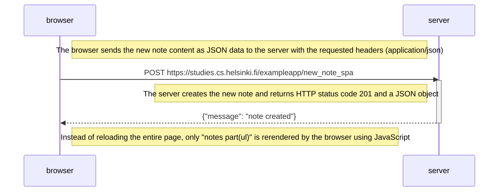

```mermaid
sequenceDiagram
  participant browser
  participant server

  Note right of browser: The browser sends the new note content as JSON data to the server with the requested headers (application/json)

  browser->>server: POST https://studies.cs.helsinki.fi/exampleapp/new_note_spa
  activate server

  note left of server: The server creates the new note and returns HTTP status code 201 and a JSON object 

  server-->>browser: {"message": "note created"}
  deactivate server

  Note right of browser: Instead of reloading the entire page, only "notes part(ul)" is rerendered by the browser using JavaScript

```
